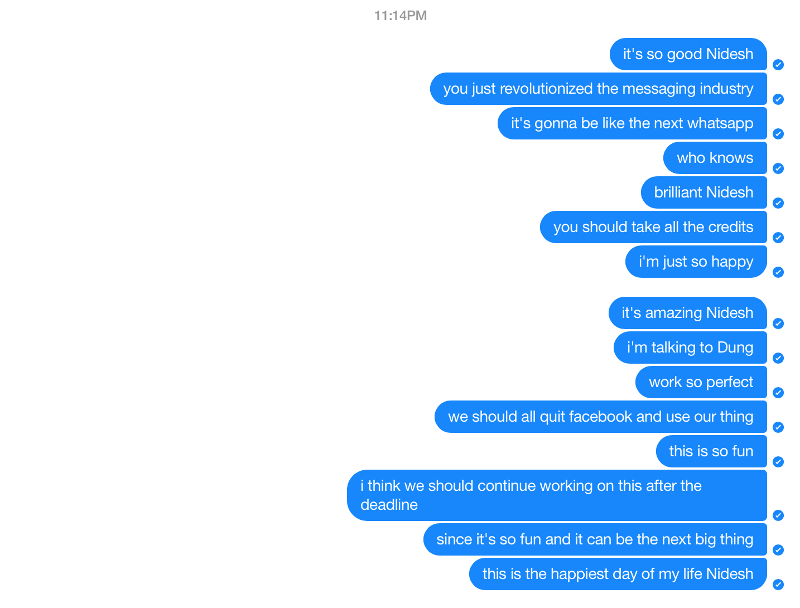

- the client terminal messed up when using ^C to quit instead of /quit
- the cursor keeps jumping to the message that you sent
- how to delete user from dict when one quits
- print out the list of online user

